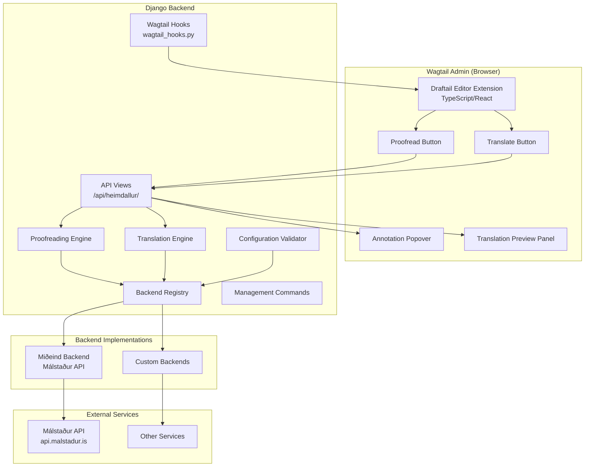
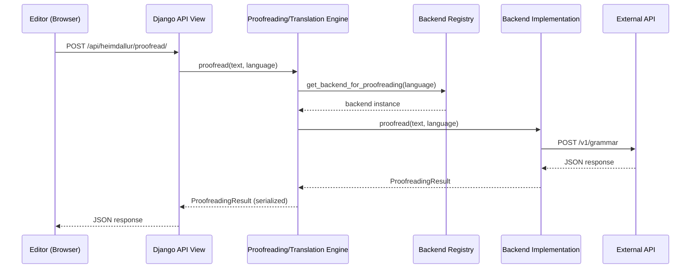

# Design Document: Wagtail-Heimdallur

## Overview

Wagtail-Heimdallur is a Wagtail CMS plugin providing inline proofreading, inline translation, and page-level translation capabilities. The plugin follows a pluggable backend architecture, shipping with a default Miðeind Málstaður backend, while allowing developers to register custom backends for any language service. It integrates into the Wagtail admin via Draftail editor extensions (TypeScript/React) and Django hooks.

### Key Design Decisions

1. **Backend abstraction via ABC classes** — Backends implement `BaseTranslationBackend` and/or `BaseProofreadingBackend`. A single class may implement both.
2. **Django AppConfig for startup validation** — The `ready()` method validates configuration and conditionally registers hooks based on feature toggles.
3. **Draftail entity-based editor extension** — Inline proofreading uses Draftail decorator entities to render annotation highlights; inline translation uses a toolbar button with a modal.
4. **Wagtail's `copy_for_translation` signal** — Page translation hooks into Wagtail's simple_translation flow to automatically translate content on locale copy.
5. **Async-capable API views** — Django views expose proofreading/translation endpoints to the frontend, with synchronous-by-default and optional async support for Django 4.1+.

## Architecture



### Request Flow



## Components and Interfaces

### Python Package Structure

```
wagtail_heimdallur/
├── __init__.py
├── apps.py                    # AppConfig with ready() validation
├── backends/
│   ├── __init__.py
│   ├── base.py                # BaseTranslationBackend, BaseProofreadingBackend
│   ├── registry.py            # BackendRegistry
│   └── mideind.py             # MideindBackend (translation + proofreading)
├── engines/
│   ├── __init__.py
│   ├── proofreading.py        # ProofreadingEngine
│   └── translation.py         # TranslationEngine
├── models.py                  # ProofreadingResult, DiffAnnotation dataclasses
├── serializers.py             # JSON serialization for ProofreadingResult
├── views.py                   # API views for proofreading/translation
├── urls.py                    # URL configuration
├── hooks.py                   # Wagtail hook registrations
├── validators.py              # ConfigurationValidator
├── exceptions.py              # Custom exception hierarchy
├── conf.py                    # Settings access and defaults
├── management/
│   └── commands/
│       └── heimdallur_check.py
├── static/
│   └── wagtail_heimdallur/
│       ├── js/                # Compiled TypeScript bundle
│       └── css/               # Editor extension styles
├── templates/
│   └── wagtail_heimdallur/
│       └── admin/             # Admin panel templates
└── client/                    # TypeScript source
    ├── src/
    │   ├── index.ts
    │   ├── proofread/
    │   │   ├── ProofreadButton.tsx
    │   │   ├── AnnotationDecorator.tsx
    │   │   └── AnnotationPopover.tsx
    │   └── translate/
    │       ├── TranslateButton.tsx
    │       ├── LanguagePairSelector.tsx
    │       └── TranslationPreview.tsx
    ├── tsconfig.json
    └── package.json
```

### Backend Abstract Classes

```python
# wagtail_heimdallur/backends/base.py

from abc import ABC, abstractmethod
from typing import List, Tuple
from wagtail_heimdallur.models import ProofreadingResult


class BaseProofreadingBackend(ABC):
    """Abstract base class for proofreading backends."""

    def __init__(self, **kwargs):
        """Initialize with backend-specific configuration options."""
        pass

    @abstractmethod
    def proofread(self, text: str, language: str) -> ProofreadingResult:
        """Proofread text and return annotated corrections."""
        ...

    @abstractmethod
    def get_supported_languages(self) -> List[str]:
        """Return list of ISO language codes supported for proofreading."""
        ...


class BaseTranslationBackend(ABC):
    """Abstract base class for translation backends."""

    def __init__(self, **kwargs):
        """Initialize with backend-specific configuration options."""
        pass

    @abstractmethod
    def translate(self, text: str, source_language: str, target_language: str) -> str:
        """Translate text from source to target language."""
        ...

    @abstractmethod
    def get_supported_language_pairs(self) -> List[Tuple[str, str]]:
        """Return list of (source, target) language code tuples."""
        ...
```

### Backend Registry

```python
# wagtail_heimdallur/backends/registry.py

class BackendRegistry:
    """Manages backend instances and language routing."""

    def __init__(self, settings: dict):
        self._backends: dict[str, object] = {}
        self._routing: dict = {}
        self._load_backends(settings)

    def get_backend_for_proofreading(self, language: str) -> BaseProofreadingBackend:
        """Resolve language routing and return the appropriate backend.

        Raises:
            UnsupportedLanguageError: If no backend supports the language.
            NoAvailableBackendError: If all capable backends are disabled.
        """
        ...

    def get_backend_for_translation(
        self, source_language: str, target_language: str
    ) -> BaseTranslationBackend:
        """Resolve language pair routing and return the appropriate backend.

        Raises:
            UnsupportedLanguageError: If no backend supports the pair.
            NoAvailableBackendError: If all capable backends are disabled.
        """
        ...
```

### Configuration Validator

```python
# wagtail_heimdallur/validators.py

class ConfigurationValidator:
    """Validates WAGTAIL_HEIMDALLUR settings at startup."""

    VALID_FEATURES = {"inline_proofreading", "inline_translation", "page_translation"}

    def validate(self, settings: dict) -> None:
        """Validate the entire settings dictionary.

        Raises:
            ImproperlyConfigured: For any invalid configuration.
        """
        self._validate_backends(settings.get("BACKENDS", {}))
        self._validate_features(settings.get("FEATURES", {}))
        self._validate_language_routing(
            settings.get("LANGUAGE_ROUTING", {}),
            settings.get("BACKENDS", {}),
        )
```

### API Views

```python
# wagtail_heimdallur/views.py

from django.http import JsonResponse
from django.views import View


class ProofreadView(View):
    """POST /api/heimdallur/proofread/
    
    Request body: {"text": "...", "language": "is"}
    Response: ProofreadingResult serialized as JSON
    """
    ...


class TranslateView(View):
    """POST /api/heimdallur/translate/
    
    Request body: {"text": "...", "source_language": "is", "target_language": "en"}
    Response: {"translated_text": "..."}
    """
    ...


class SupportedLanguagesView(View):
    """GET /api/heimdallur/languages/
    
    Response: {"proofreading": ["is", ...], "translation_pairs": [["is", "en"], ...]}
    """
    ...
```

### Wagtail Hooks

```python
# wagtail_heimdallur/hooks.py

from wagtail import hooks
from wagtail_heimdallur.conf import get_settings


@hooks.register("register_rich_text_features")
def register_heimdallur_features(features):
    """Register Draftail editor extensions based on feature toggles."""
    settings = get_settings()

    if settings["FEATURES"].get("inline_proofreading", True):
        features.register_editor_plugin(
            "draftail", "PROOFREAD", {
                "type": "PROOFREAD",
                "source": "ProofreadSource",
                "decorator": "ProofreadDecorator",
            }
        )

    if settings["FEATURES"].get("inline_translation", True):
        features.register_editor_plugin(
            "draftail", "TRANSLATE", {
                "type": "TRANSLATE",
                "source": "TranslateSource",
            }
        )
```

### Draftail Editor Extension (TypeScript)

The editor extension follows the pattern established by wagtail-ai, registering React components via Wagtail's Draftail plugin system.

```typescript
// client/src/proofread/ProofreadButton.tsx

interface ProofreadSourceProps {
  editorState: EditorState;
  onComplete: (editorState: EditorState) => void;
  onClose: () => void;
}

// Triggered when user clicks the Proofread toolbar button.
// Sends field content to the backend API, receives annotations,
// and applies inline entity decorators to highlight corrections.
```

```typescript
// client/src/proofread/AnnotationDecorator.tsx

interface AnnotationDecoratorProps {
  contentState: ContentState;
  entityKey: string;
  children: React.ReactNode;
}

// Renders inline highlight for a single diff annotation.
// On click, opens AnnotationPopover with accept/dismiss actions.
```

## Data Models

### Core Data Structures

```python
# wagtail_heimdallur/models.py

from dataclasses import dataclass, field
from typing import List
import json


@dataclass
class DiffAnnotation:
    """A single correction annotation with character positions."""
    orig_start_idx: int
    orig_end_idx: int
    orig_string: str
    changed_start_idx: int
    changed_end_idx: int
    changed_string: str
    change_type: str  # e.g., "spelling", "grammar", "style"

    def to_dict(self) -> dict:
        return {
            "orig_start_idx": self.orig_start_idx,
            "orig_end_idx": self.orig_end_idx,
            "orig_string": self.orig_string,
            "changed_start_idx": self.changed_start_idx,
            "changed_end_idx": self.changed_end_idx,
            "changed_string": self.changed_string,
            "change_type": self.change_type,
        }

    @classmethod
    def from_dict(cls, data: dict) -> "DiffAnnotation":
        return cls(
            orig_start_idx=data["orig_start_idx"],
            orig_end_idx=data["orig_end_idx"],
            orig_string=data["orig_string"],
            changed_start_idx=data["changed_start_idx"],
            changed_end_idx=data["changed_end_idx"],
            changed_string=data["changed_string"],
            change_type=data["change_type"],
        )


@dataclass
class ProofreadingResult:
    """Complete proofreading result with original, corrected text and annotations."""
    original_text: str
    corrected_text: str
    annotations: List[DiffAnnotation] = field(default_factory=list)

    def to_json(self) -> str:
        return json.dumps({
            "original_text": self.original_text,
            "corrected_text": self.corrected_text,
            "annotations": [a.to_dict() for a in self.annotations],
        })

    @classmethod
    def from_json(cls, json_str: str) -> "ProofreadingResult":
        data = json.loads(json_str)
        return cls(
            original_text=data["original_text"],
            corrected_text=data["corrected_text"],
            annotations=[
                DiffAnnotation.from_dict(a) for a in data["annotations"]
            ],
        )
```

### Settings Structure

```python
# Example WAGTAIL_HEIMDALLUR settings dictionary

WAGTAIL_HEIMDALLUR = {
    "FEATURES": {
        "inline_proofreading": True,
        "inline_translation": True,
        "page_translation": True,
    },
    "BACKENDS": {
        "mideind": {
            "CLASS": "wagtail_heimdallur.backends.mideind.MideindBackend",
            "OPTIONS": {
                "api_key": "your-api-key",
                "base_url": "https://api.malstadur.is",
                "timeout": 30,
            },
            "enabled": True,
        },
    },
    "LANGUAGE_ROUTING": {
        "proofreading": {
            "is": "mideind",
        },
        "translation": {
            ("is", "en"): "mideind",
            ("en", "is"): "mideind",
        },
    },
}
```

### API Request/Response Schemas

**Proofreading Request (internal API):**
```json
{
  "text": "Þetta er texti með villu.",
  "language": "is"
}
```

**Proofreading Response (internal API):**
```json
{
  "original_text": "Þetta er texti með villu.",
  "corrected_text": "Þetta er texti með villu.",
  "annotations": [
    {
      "orig_start_idx": 15,
      "orig_end_idx": 18,
      "orig_string": "með",
      "changed_start_idx": 15,
      "changed_end_idx": 18,
      "changed_string": "með",
      "change_type": "grammar"
    }
  ]
}
```

**Málstaður API Grammar Request:**
```
POST https://api.malstadur.is/v1/grammar
Headers: X-API-KEY: <key>, Content-Type: application/json
Body: {"text": "...", "language": "is"}
```

**Málstaður API Grammar Response:**
```json
{
  "results": [
    {
      "originalText": "...",
      "changedText": "...",
      "diffAnnotations": [
        {
          "origStartIdx": 0,
          "origEndIdx": 5,
          "origString": "...",
          "changedStartIdx": 0,
          "changedEndIdx": 5,
          "changedString": "...",
          "changeType": "spelling"
        }
      ]
    }
  ]
}
```

### Exception Hierarchy

```python
# wagtail_heimdallur/exceptions.py

class BackendError(Exception):
    """Base exception for all backend errors."""
    pass

class AuthenticationError(BackendError):
    """Raised when API credentials are invalid or exhausted."""
    pass

class BackendTimeoutError(BackendError):
    """Raised when a backend request exceeds the configured timeout."""
    pass

class BackendRequestError(BackendError):
    """Raised when the backend returns HTTP 400 (bad request)."""
    pass

class UnsupportedLanguageError(BackendError):
    """Raised when no backend supports the requested language/pair."""
    pass

class UnsupportedLanguagePairError(UnsupportedLanguageError):
    """Raised when a specific language pair is not available."""
    pass

class NoAvailableBackendError(BackendError):
    """Raised when all backends for an operation are disabled."""
    pass
```


## Correctness Properties

*A property is a characteristic or behavior that should hold true across all valid executions of a system—essentially, a formal statement about what the system should do. Properties serve as the bridge between human-readable specifications and machine-verifiable correctness guarantees.*

### Property 1: ProofreadingResult serialization round-trip

*For any* valid `ProofreadingResult` object containing arbitrary original text, corrected text, and any number of `DiffAnnotation` objects with valid character indices and change types, serializing to JSON then deserializing back SHALL produce an equivalent `ProofreadingResult` object.

**Validates: Requirements 11.1, 11.2, 11.3**

### Property 2: Feature toggle conditional registration

*For any* combination of the three feature toggles (`inline_proofreading`, `inline_translation`, `page_translation`) set to `True` or `False`, the plugin SHALL register hooks, views, and UI elements exclusively for those features whose toggle is `True`, and SHALL not register any hooks, views, or UI elements for features whose toggle is `False`.

**Validates: Requirements 1.2, 1.10, 12.5, 12.6, 12.7**

### Property 3: Feature toggle defaults to enabled

*For any* subset of the three recognized feature toggle keys omitted from the `FEATURES` dictionary, the plugin SHALL resolve each omitted key to `True` (enabled).

**Validates: Requirements 1.9**

### Property 4: Proofreading language routing resolution

*For any* valid configuration containing a `LANGUAGE_ROUTING.proofreading` mapping and multiple enabled backends, when `get_backend_for_proofreading(language)` is called with a language present in the routing table, the registry SHALL return the backend instance identified by the routing entry for that language.

**Validates: Requirements 2.8, 2.10**

### Property 5: Translation language pair routing resolution

*For any* valid configuration containing a `LANGUAGE_ROUTING.translation` mapping and multiple enabled backends, when `get_backend_for_translation(source, target)` is called with a pair present in the routing table, the registry SHALL return the backend instance identified by the routing entry for that pair.

**Validates: Requirements 2.9, 2.11**

### Property 6: Routing fallback to first capable backend

*For any* language or language pair NOT present in the Language_Routing_Table, and given at least one enabled backend that supports the requested operation for that language, the registry SHALL return the first configured backend that declares support for the language.

**Validates: Requirements 1.13**

### Property 7: Invalid backend references in routing rejected

*For any* `LANGUAGE_ROUTING` entry whose backend identifier does not exist in the `BACKENDS` dictionary, the `ConfigurationValidator` SHALL raise `ImproperlyConfigured` during validation.

**Validates: Requirements 1.14**

### Property 8: Unrecognized feature names rejected

*For any* string key in the `FEATURES` dictionary that is not one of the three valid feature names (`inline_proofreading`, `inline_translation`, `page_translation`), the `ConfigurationValidator` SHALL raise `ImproperlyConfigured`.

**Validates: Requirements 1.16**

### Property 9: Backend options pass-through

*For any* dictionary of configuration options specified under a backend's `OPTIONS` key in the settings, all key-value pairs SHALL be passed as keyword arguments to the backend's `__init__` method.

**Validates: Requirements 2.5**

### Property 10: Unsupported language raises error

*For any* language (for proofreading) or language pair (for translation) where no registered and enabled backend declares support, the registry SHALL raise `UnsupportedLanguageError`.

**Validates: Requirements 2.12, 4.7**

### Property 11: Málstaður response parsing preserves all annotations

*For any* valid Málstaður API grammar response containing `results[].originalText`, `results[].changedText`, and any number of `diffAnnotations` entries, parsing the response SHALL produce a `ProofreadingResult` whose `annotations` list has the same count and field values (mapped from camelCase to snake_case) as the source response.

**Validates: Requirements 3.3**

### Property 12: Page translation processes all translatable field types

*For any* Wagtail page containing a mix of plain text fields, rich text fields, and StreamField blocks with text content, page translation SHALL invoke the translation backend for every translatable text segment across all field types.

**Validates: Requirements 5.2**

### Property 13: Partial field failure does not prevent remaining translations

*For any* page with N translatable fields where K fields (0 < K < N) fail during translation, the remaining N-K fields SHALL still be translated successfully and the translated content for those fields SHALL be present in the resulting draft page.

**Validates: Requirements 5.5**

### Property 14: Annotation correction application

*For any* text and valid `DiffAnnotation` with `orig_start_idx` and `orig_end_idx` within bounds, applying the correction SHALL replace exactly the substring at `[orig_start_idx:orig_end_idx]` with `changed_string`, leaving all other text unchanged.

**Validates: Requirements 6.5**

### Property 15: Unexpected exceptions wrapped as BackendError

*For any* exception raised by a backend that is not a subclass of `BackendError`, the plugin's engine layer SHALL catch it and re-raise it as a `BackendError` with the original exception as the cause.

**Validates: Requirements 8.2**

### Property 16: No partial modifications on backend failure

*For any* page content state and any backend operation that raises an exception partway through processing, the page content after the failed operation SHALL be identical to the page content before the operation.

**Validates: Requirements 8.4**

### Property 17: Disabled backends excluded from routing

*For any* backend with `enabled` set to `False` in its configuration, the registry SHALL never return that backend from `get_backend_for_proofreading()` or `get_backend_for_translation()` regardless of language routing entries pointing to it.

**Validates: Requirements 12.8, 12.9**

### Property 18: All backends disabled raises NoAvailableBackendError

*For any* configuration where all backends capable of a requested operation (proofreading or translation) for a given language are set to `enabled: False`, the registry SHALL raise `NoAvailableBackendError`.

**Validates: Requirements 12.10**

### Property 19: Management command output completeness

*For any* valid plugin configuration, the `heimdallur_check` management command output SHALL contain every enabled feature name, every active backend identifier with its supported languages, and every entry from the resolved language routing table.

**Validates: Requirements 12.11, 12.12**

## Error Handling

### Strategy

The plugin employs a layered error handling approach:

1. **Backend Layer** — Each backend implementation raises typed exceptions from the `BackendError` hierarchy. The Miðeind backend maps HTTP status codes to specific exception types.

2. **Engine Layer** — The proofreading and translation engines wrap unexpected exceptions into `BackendError`, ensuring the API view layer always receives well-typed errors. Engines also enforce atomicity — if an operation fails, no partial state is persisted.

3. **API View Layer** — Views catch `BackendError` subclasses and return appropriate HTTP responses with user-friendly error messages. Django's standard 500 handling covers truly unexpected failures.

4. **Frontend Layer** — The TypeScript editor extension handles API error responses by displaying notification toasts. The UI never enters a broken state — failed operations simply show an error and preserve the current content.

### Error Response Format

All API error responses follow a consistent JSON structure:

```json
{
  "error": {
    "type": "AuthenticationError",
    "message": "API credentials are invalid or exhausted.",
    "details": {}
  }
}
```

### Timeout Configuration

- Default timeout: 30 seconds per backend HTTP call
- Configurable via `OPTIONS.timeout` in backend settings
- The `httpx` library (or `requests`) handles timeout enforcement

### Logging

All backend interactions are logged at DEBUG level:
```
DEBUG wagtail_heimdallur.backends.mideind: POST https://api.malstadur.is/v1/grammar -> 200 (1.23s)
```

Errors are logged at ERROR level with full tracebacks for unexpected exceptions.

## Testing Strategy

### Test Framework and Tools

- **Python tests**: `pytest` with `pytest-django`
- **Property-based testing**: `hypothesis` (Python)
- **HTTP mocking**: `responses` or `httpx-mock`
- **TypeScript tests**: `jest` with `@testing-library/react`
- **Test runner**: `tox` for matrix testing across Python/Django/Wagtail versions

### Property-Based Tests (Hypothesis)

Each correctness property maps to a Hypothesis test with a minimum of 100 iterations. Tests use `@given` decorators with custom strategies for generating:

- `ProofreadingResult` objects with random text and annotations
- Settings dictionaries with random feature toggle combinations
- Language routing tables with random backend assignments
- Málstaður API response payloads with varying annotation counts

Tag format for each property test:
```python
# Feature: wagtail-heimdallur, Property 1: ProofreadingResult serialization round-trip
@given(result=proofreading_result_strategy())
@settings(max_examples=100)
def test_proofreading_result_round_trip(result):
    ...
```

### Unit Tests (Example-Based)

Focus on:
- Specific error scenarios (HTTP 401, 403, 500, 504 responses)
- Abstract base class enforcement (cannot instantiate ABCs)
- Hook registration verification
- Management command output format
- Draftail plugin registration

### Integration Tests

Focus on:
- End-to-end page translation flow with mocked backend
- Wagtail hook signal handling (`copy_for_translation`)
- Docker-based demo site startup

### Frontend Tests

- Component rendering tests for ProofreadButton, TranslateButton
- Popover interaction tests (accept/dismiss)
- API call mocking with MSW (Mock Service Worker)
- Accessibility checks for editor UI elements

### Test Organization

```
tests/
├── conftest.py                    # Shared fixtures, strategies
├── strategies.py                  # Hypothesis strategies
├── test_models.py                 # Data model tests
├── test_serialization.py          # Round-trip property tests
├── test_backends/
│   ├── test_registry.py           # Backend registry + routing
│   └── test_mideind.py            # Miðeind backend (mocked HTTP)
├── test_engines/
│   ├── test_proofreading.py       # Proofreading engine
│   └── test_translation.py        # Translation engine
├── test_validators.py             # Configuration validation
├── test_views.py                  # API view tests
├── test_hooks.py                  # Wagtail hook registration
├── test_management_commands.py    # heimdallur_check command
└── client/                        # TypeScript/Jest tests
    ├── proofread/
    └── translate/
```
